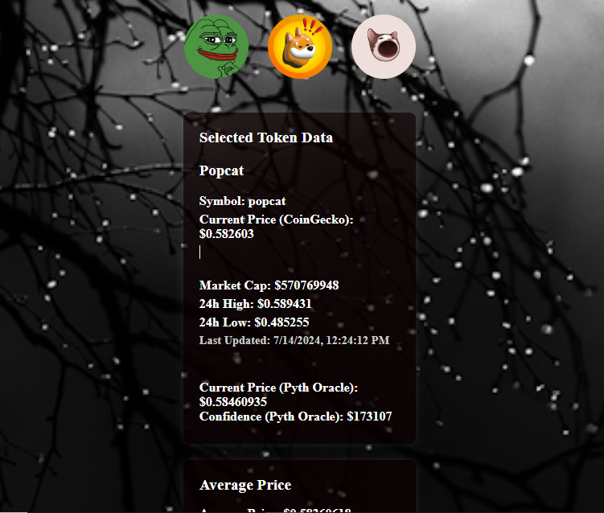

# S_T_O_O_A
STO and ours is the project OA

# Oracle Aggregator

## Description
A DeFi application that fetches price feeds from multiple oracles, calculates an average, and displays it on the frontend.

## How to Build and Launch

1. Clone the repository:
   ```bash
   git clone https://github.com/your-username/oracle-aggregator.git
   cd oracle-aggregator```
2. Open index.html in your browser to view the application.

## Screenshots



## Video Demonstration
Link to the video demonstrating the Oracle Aggregator in action: https://youtu.be/p6vQY46ZvlA

## License
This project is licensed under the MIT License.

#### Deployment

Deploy the application on Cloudflare or Vercel:

- **Cloudflare:** Upload the files directly or use the Pages feature.
- **Vercel:** Use the Vercel CLI to deploy the project.

#### Video Demonstration

A short video (20-30 seconds) showing the Oracle Aggregator fetching and displaying the price.

### Summary

By following the steps above, you can view, build, test and deploy the Oracle Aggregator. Best regards...

